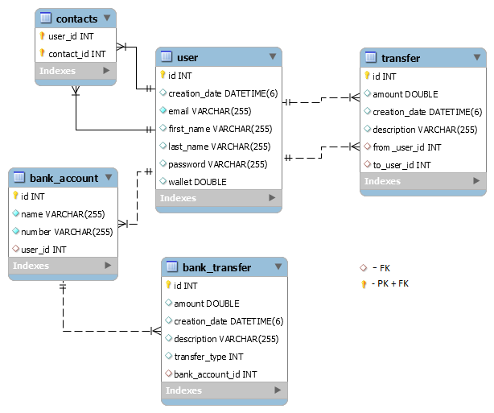

# Pay my Buddy

We make moving your money easy!

API REST application for money transfer. 

### Getting Started

* Endpoint : <http://localhost:8080/>
* Actuator : <http://localhost:8080/actuator>

### Prerequisites

What things you need to install the software and how to install them

- Java 1.8
- Maven 3.6.2
- Spring Boot 2.3.3
- My SQL 8.0

### Installing

A step by step series of examples that tell you how to get a development env running:

1.Install Java:

- https://docs.oracle.com/javase/8/docs/technotes/guides/install/install_overview.html

2.Install Maven:

- https://maven.apache.org/install.html

3.Initialize Spring Boot 

- https://start.spring.io/

4.Run the sql command create.sql

- https://dev.mysql.com/downloads/mysql/
   
User and password to access to the DB are stored in *Environnement Variables*;. Use application.properties to change.

### Running App

To start the application execute :

**java -jar buddy-0.0.1-SNAPSHOT.jar**

### Testing

The app has unit tests and integration tests written. 
To run the tests from maven, go to the folder that contains the pom.xml file and execute the below command.

`mvn test`

## Class Diagram

## Database Schema

